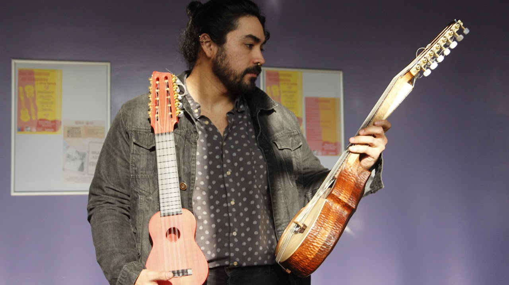

---js
const eleventyNavigation = {
 key: "Info",
 order: 2
}
---

# Info

Lutheria Postdigital es un grupo de investigación de la Universidad de Chile.

## Equipo

### Carolina Espinoza

Dra. en física y música autodidacta. Actualmente Profesora Asociada del Departamento de Sonido de la Facultad de Artes de la Universidad de Chile, Directora del Laboratorio de Acústica Musical y Luthería Postdigital (LAÚD) de dicha unidad, y estudiante de Luthería con el maestro Roberto Hernández. Sus intereses e investigaciones giran en torno al estudio de las relaciones entre materialidad y sonido desde sus fundamentos físico-matemáticos, perceptuales, hasta sus alcances artísticos. Ha trabajado en investigaciones relacionadas con la caracterización acústica y mecánica de materiales como metales, maderas, polímeros y biomateriales. Realiza investigaciones y creaciones en torno a la aplicación de nuevos materiales en la fabricación de instrumentalidades musicales, reflexionando desde la Luthería Postdigital sobre las relaciones entre tradición y nuevas técnicas de fabricación. En conjunto con investigadoras e investigadores del Museo de Arte Popular Americano (MAPA) explora su colección de instrumentos patrimoniales, en busca de proponer nuevas formas de preservación e interacción con éstos. En el área musical se he desarrollado como autora, compositora e intérprete.

### Claudio Carreño

Luthier tradicional y postdigital de cordófonos latinoamericanos. Co-investigador en el Laboratorio de Acústica Musical y Luthería Postdigital del Departamento de Sonido de la Universidad de Chile (LAÚD), y actualmente estudiante de Ingeniería Civil Mecánica en la Universidad de Chile.  Una de sus principales líneas de innovación es el sistema de contradiapasón, propuesta que apunta a aumentar la tesitura y número de cuerdas de instrumentos de cuerda como la guitarra, el charango, entre otros. En el ámbito digital, sus principales aportes se encuentran en el área de diseño y fabricación, con énfasis y técnicas aditivas y sustractivas. En conjunto con investigadoras e investigadores del Museo de Arte Popular Americano (MAPA) explora su colección de instrumentos patrimoniales, enfocado principalmente en el desarrollo de réplicas a partir de modelos digitales obtenidos vía escaneo 3D. En el área musical se ha desarrollado de manera autodidacta como compositor e intérprete en piano y contradia (guitarra con sistema de contradiapasón, instrumento de su invención).
